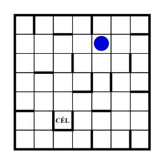

Juttassuk el a golyót az ábrán látható labirintus megjelölt mezőjére!\
A golyó a négy égtáj irányában mozoghat.\
Ha elindul valamelyik irányba, akkor addig gurul,
amíg falba vagy a pálya szélébe nem ütközik.

Get the ball into the goal field in the maze.\
The ball can move to the four cardinal directions (north, south, east, and west).\
The ball is rolling as long as it's not colliding to a wall.

